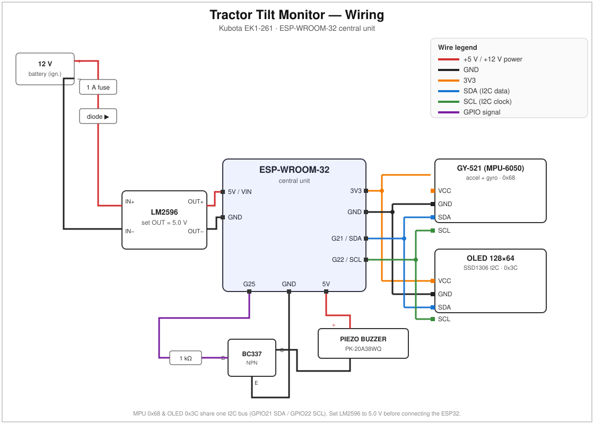

# Tractor Tilt Monitor — Kubota EK1-261

A cabin-mounted tilt safety monitor for a tractor. It measures lateral (roll) and
longitudinal (pitch) tilt, shows them on an OLED, and sounds a buzzer when a
threshold is exceeded.

> ⚠️ **This is an assistive warning device — not a substitute for a ROPS/seatbelt
> or for safe operation.** The default thresholds are a conservative estimate;
> verify and tune them on the actual machine on a controlled slope.

## Components

- **ESP-WROOM-32** dev board (USB-C, CH340) — the central unit / brain
- **GY-521 (MPU-6050)** — accelerometer + gyroscope, I2C, measures tilt
- **OLED 0.96" 128x64, I2C (SSD1306)** — shows tilt angles and status
- **HITPOINT PK-20A38WQ** piezo buzzer — audible alarm
- **DIOTEC BC337-40** NPN transistor — drives the buzzer
- **~1 kΩ resistor** — base resistor for the BC337
- **S-BOX 116B** enclosure — mounting in the cabin
- **ZY-60 breadboard** — prototyping before soldering

Powered by **USB 5 V** from the tractor's USB port — just plug into the ESP32's
USB-C. (A CREATALL CA-2596 / LM2596 step-down is only needed if you instead wire
it to a raw 12 V circuit — not the case here.)

## Wiring diagram



## Wiring to the central unit (ESP-WROOM-32)

### GY-521 (MPU-6050) — I2C
| MPU-6050 pin | ESP32 pin |
|---|---|
| VCC | 3V3 |
| GND | GND |
| SDA | GPIO21 |
| SCL | GPIO22 |

### OLED SSD1306 — I2C (shares the bus with the MPU)
| OLED pin | ESP32 pin |
|---|---|
| VCC | 3V3 |
| GND | GND |
| SDA | GPIO21 |
| SCL | GPIO22 |

The MPU is at I2C address `0x68`, the OLED at `0x3C` — no conflict on the shared bus.

### Buzzer via BC337 (NPN, low-side switch)
```
GPIO25 ──[ 1k ]── B (BC337 base)
                  C ── one buzzer terminal
                  E ── GND
   +5V ───────────── other buzzer terminal
```
- BC337 pinout (flat side facing you, leads down): **C – B – E** (verify in the
  DIOTEC 171553 datasheet).
- For a louder alarm, tie the buzzer's high side to +12 V instead of +5 V
  (the PK-20A38WQ tolerates it); the emitter still goes to GND, logic unchanged.

### Zero / level button
The onboard **BOOT button (GPIO0)** is used to zero the tilt on flat ground
(see Calibration).

## Power (USB)

Plug the ESP32's **USB-C** into the tractor's **USB port (5 V)** — that's it. The
buzzer's high side is tied to the ESP32 `5V` pin, which carries that USB 5 V.

- During engine **cranking** the USB rail can dip and briefly reset the ESP32.
  Harmless here, but if it bothers you, power it up after starting, or add a
  ~470 µF cap across 5 V / GND.
- Make sure the port can supply ~500 mA (most can).
- If you ever power it from a raw **12 V** line instead, put an LM2596 step-down
  set to **5.0 V** (plus a fuse and reverse-polarity diode) ahead of the ESP32.

## Calibration & setup

1. **Mounting:** bolt the S-BOX enclosure rigidly into the cabin (not loose — a
   loose box measures its own bouncing, not the tractor). It need not be perfectly
   level.
2. **Zeroing:** park on **flat ground**, power on, and press the **BOOT button
   (GPIO0)**. The current position is stored as "0°", compensating for a tilted
   mount.
3. **Thresholds** in the `.ino` (`TILT_WARN`, `TILT_DANGER`) — tune on the machine.

## Tilt thresholds — important

Defaults: `WARN = 12°`, `DANGER = 20°` (total tilt from vertical).

Small compact tractors like the EK1-261 have a high center of gravity and tip
over sooner than most people expect — especially sideways and when driving along
a slope contour. The static tip-over angle is ~30–40°, but under motion (inertia,
load, terrain) the safe limit drops significantly. Therefore:

- Set the warning **well below** the real tip-over angle.
- Tune **carefully, on a gentle slope, with an escape route** — ideally without a
  driver (remote) or with seatbelt + ROPS.
- Watch **roll (lateral tilt)** in particular — it is more dangerous than pitch.

## Libraries (Arduino IDE)
- ESP32 core (Espressif) — code uses the `ledc` API (works on core 2.x and 3.x)
- **Adafruit SSD1306** + **Adafruit GFX**
- The MPU-6050 is read directly over `Wire` (no library)

Board: **ESP32 Dev Module**. Serial Monitor **115200**.
